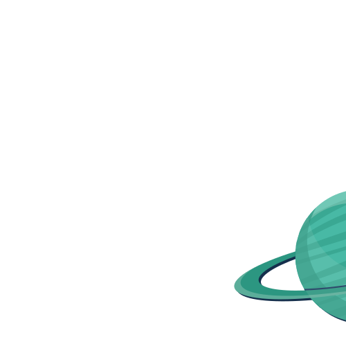

<!-- Improved compatibility of back to top link: See: https://github.com/othneildrew/Best-README-Template/pull/73 -->
<a name="readme-top"></a>
<!--
*** Thanks for checking out the Best-README-Template. If you have a suggestion
*** that would make this better, please fork the repo and create a pull request
*** or simply open an issue with the tag "enhancement".
*** Don't forget to give the project a star!
*** Thanks again! Now go create something AMAZING! :D
-->


<!-- PROJECT SHIELDS -->
<!--
*** I'm using markdown "reference style" links for readability.
*** Reference links are enclosed in brackets [ ] instead of parentheses ( ).
*** See the bottom of this document for the declaration of the reference variables
*** for contributors-url, forks-url, etc. This is an optional, concise syntax you may use.
*** https://www.markdownguide.org/basic-syntax/#reference-style-links
-->


<!-- PROJECT LOGO -->
<br />
<div align="center">
    

  <h3 align="center">The Quantum Portfolio</h3>

  <p align="center">
    Take a journey through my work experince and the stars!
    <br />
    <br />
    <br />
    <a href="https://tybensonportfolio.com">View live site</a>
    ·
    <a href="https://github.com/Tybenson0/Pi-Ponics/issues">Report Bug</a>
    ·
    <a href="https://github.com/Tybenson0/Pi-Ponics/pulls">Request Feature</a>
  </p>
</div>


<!-- TABLE OF CONTENTS -->
<details>
  <summary>Table of Contents</summary>
  <ol>
    <li>
      <a href="#about-the-project">About The Quantum Portfolio</a>
      <ul>
        <li><a href="#built-with">Built With</a></li>
      </ul>
    </li>
    <li>
      <a href="#getting-started">Getting Started</a>
      <ul>
        <li><a href="#prerequisites">Prerequisites</a></li>
      </ul>
    </li>
    <li><a href="#usage">Usage</a></li>
    <li><a href="#license">License</a></li>
    <li><a href="#contact">Contact</a></li>
  </ol>
</details>

<br />
<br />


<!-- ABOUT THE PROJECT -->
## About The Quantum Portfolio
<div align="center">

</div>
<p> The Quantum Portfolio is a showcase of my knowledge and experience with the popular framework React and the powerful state management library. This portfolio showcases all of my previous projects and portrays how much
I have grown in my web development journey and how passionate I am about this field! </p>
<br />
<br />
<br />
Let's code the stars!

<p align="right">(<a href="#readme-top">back to top</a>)</p>
<br />
<br />


### Built With
<br />

The Quantum Portfolio is a React app made with various libraries and packages including...
<br />
<br />

<div align="center">
  
&nbsp;&nbsp;&nbsp;

&nbsp;&nbsp;&nbsp;

&nbsp;&nbsp;&nbsp;

&nbsp;&nbsp;&nbsp;

&nbsp;&nbsp;&nbsp;

&nbsp;&nbsp;&nbsp;

</div>
<br />
<br />
<br />
<br />


<p align="right">(<a href="#readme-top">back to top</a>)</p>


<!-- GETTING STARTED -->
## Getting Started

Test out the code for yourself and leave any recomendations!

<div align="center">

</div>

### Prerequisites


[](https://nodejs.org/)
[](https://www.npmjs.com/)


<!-- USAGE EXAMPLES -->
## Usage

* Clone Repository
  ```sh
  git clone https://github.com/your-username/your-repo.git
  ```
  * Install Dependencies
  ```sh
  npm install
  ```
  * Run the App
  ```sh
  npm run start
  ```


<br />
<br />


<p align="right">(<a href="#readme-top">back to top</a>)</p>


<br />

<!-- LICENSE -->
## License

Distributed under the MIT License. See `LICENSE.txt` for more information.

<p align="right">(<a href="#readme-top">back to top</a>)</p>


<!-- CONTACT -->
## Contact

Ty Benson -  tybensontraining@gmail.com

Project Link: [https://github.com/Tybenson0/Pi-Ponics](https://github.com/Tybenson0/Pi-Ponics)

<p align="right">(<a href="#readme-top">back to top</a>)</p>
<div align="center">

</div>
<br />
<br />
<br />
